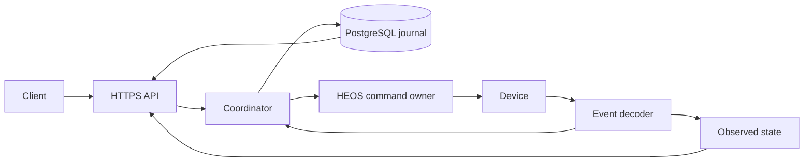

# Architecture

`heos-control` exposes an authenticated HTTPS API for local HEOS playback and
bounded playback envelopes. Clients choose media and schedules; the service owns
accepted operations until completion, cancellation or loss of control. There is
no alarm endpoint or server-side random album selection.

PostgreSQL stores all durable application state. Device connections, event
observations, ownership and monotonic timers belong to one running controller.
The service therefore runs as one process and one replica, with `Recreate`
rollouts. Removing local storage does not make concurrent controllers safe:
database fencing cannot stop an isolated process from sending device commands.

## Code boundaries

| Location | Responsibility |
| --- | --- |
| [`cmd/heos-control`](../cmd/heos-control) | CLI entrypoint: serving, migrations, version and diagnostics |
| [`internal/app`](../internal/app) | Wiring, startup recovery, event forwarding and bounded shutdown |
| [`internal/api`](../internal/api) | HTTPS, authentication, authorization, OpenAPI validation, SSE and metrics |
| [`internal/control`](../internal/control) | Admission, per-device coordination, ownership and playback policies |
| [`internal/heos`](../internal/heos) | Pinned TLS transport, command serialization, event decoding, observation and catalog browsing |
| [`internal/journal`](../internal/journal) | PostgreSQL transactions, reservations, idempotency, history, retention and migrations |
| [`internal/config`](../internal/config) | Strict configuration and credential loading; offline file and policy checks |
| [`internal/telemetry`](../internal/telemetry) | Bounded per-player counters and authorized metric collection |

The HTTP implementation uses `net/http` and generated `oapi-codegen` bindings.
[`api/openapi.yaml`](../api/openapi.yaml) is the public contract. Journal queries
use native `pgx`/`pgxpool` and generated `sqlc` code; generated database types stay
inside the journal package. Goose uses the pgx standard-library adapter only for
migration execution. Domain policies do not depend on HTTP DTOs or client code.

## An operation through the service

1. The API authenticates the principal and checks scopes and player access before
   returning cached or idempotent results. Request validation and domain checks
   normalize input without mixing caller input with effective defaults.
2. The coordinator looks up the idempotency key before mutable admission checks.
   New work needs a fresh observation, matching physical identity and TLS pin,
   an ungrouped target, and explicitly enabled writes with a verified ceiling.
3. One PostgreSQL transaction records the operation, idempotency mapping and
   device reservation. Transactions never remain open across device I/O or
   timers. Only a newly created, confirmed admission starts execution.
4. HTTP `202` reports durable admission, not successful playback. Execution uses
   an application-owned context and survives the submitting client's disconnect.
   A matching retry returns the original operation without repeating selection
   or replacing the queue again.
5. The coordinator serializes operations per physical device. The transport
   serializes commands on the connection and has a separate priority stop path.
   A synchronous, nonblocking event callback updates ownership; the existing
   bounded event consumer also forwards events to the observer. There is no
   additional socket or event reader for active playback.
6. Finalization records the outcome and releases the reservation atomically.
   An uncertain journal acknowledgement is resolved by reading the intended
   record and revision, never by repeating device commands.

History queries read PostgreSQL only. Authorization is applied before ordering
and pagination; cursors describe a live view rather than a frozen snapshot.
SSE provides bounded change notifications, with a resnapshot signal after gaps.
See [API usage](API_USAGE.md) for request and result contracts.

## Observation and confirmation

A full observation establishes physical identity, controls, media and queue.
Continuous, valid events maintain that baseline between audits. Event fields are
decoded once into immutable values shared by observation, ownership and
completion diagnostics. Missing, duplicate or invalid fields cannot confirm a
command; duplicate notifications with the currently confirmed values are benign.

| Situation | Device reads |
| --- | --- |
| Initial admission or preflight | Forced full observation |
| Contiguous state, volume/mute, repeat or shuffle event | Update the observed projection; no GET |
| Valid playback progress | No GET and no renewal of state age |
| Now-playing notification | Coalesced metadata read against the retained complete queue |
| Queue/group/global changes, malformed events or gaps | Invalidate state; full observation is required |
| Normal active volume step or hold | Confirmed event-maintained state; no full read before or after the setter |
| Baseline audit | Full observation every 300 seconds; cache TTL is 310 seconds |

Event projections and metadata reads retain the last full `ObservedAt`; they do
not renew the audit deadline or repair expired state. Event-driven refreshes
coalesce over 250 ms. A 60-second idle heartbeat checks the connection without
renewing state age; failed observation retries back off from one to 30 seconds.

Scalar writes register expectations before sending. Confirmation requires both a
successful reply and complete matching events for the changed fields, in either
order. Unchanged fields need no new event. Volume confirmation also handles the
observed Home 150 unmute side effect. A successful reply alone is not evidence
that the new state has already applied.

Scalar confirmation has a twelve-second total budget, capped by the remaining
playback window. Its final second permits one targeted fallback: volume plus
mute reads, or a play-mode read. A shorter remaining playback window waits only
for events and ends without an early fallback. No next setter runs while its
predecessor is unconfirmed. Partial notifications and duplicates do not renew
this deadline. Initial queue and transport confirmation instead use bounded
full readback, event wakes, a one-second backup and 250 ms minimum read spacing.

Every write still needs local ownership validation and a current-token wire
guard valid for at most five seconds. Positive automation steps are additionally
capped by the original playback deadline, rechecked after journal I/O. Separate
connection, event and local-write revisions prevent an old observation from
authorizing a later command without treating our own write as a lost event.

## Bounded playback and ownership

An unreserved stopped or paused player can start; replacing playing media needs
explicit takeover and confirmed Stop first. The service confirms preparation
and native queue replacement before starting the monotonic ramp/hold/fade
schedule. It verifies the complete queue and the current media ID/queue ID pair.
Missed volume steps are skipped instead of being sent in a burst.

Natural transitions and manual Next/Previous within that unchanged queue preserve
the original schedule. Stop or `unknown` suspends writes for up to twelve seconds,
capped by the playback deadline. A temporary mismatched media/queue ID pair can
also enter that read-only wait when both identifiers belong to the owned queue.
Resume requires confirmed Play with the exact pair and unchanged controls.
Transition checks use targeted playback-state and media reads, retaining the
complete queue; they do not turn the normal hold into a polling loop.

Pause, unrelated volume/mute/mode changes, queue/source/group changes or event
gaps revoke ownership and remove future automation writes, including scheduled
Stop. A persistent Stop releases ownership without cleanup. HEOS cannot identify
who initiated a transition, so Stop followed by Play within the allowed window
may preserve an active run; API Stop and Pause cancel immediately. Detailed rule
priority is in [Queue decisions](QUEUE_DECISIONS.md).

Final zero and Stop may complete bounded confirmation after the original stop
time; they never extend the envelope or permit later volume increases. Unknown
or stale state cannot authorize playback starts or increases. Ambiguous command
outcomes invalidate the connection generation and are not replayed. A stale guard
may be retried at most three times only when delivery is proven not sent, with
fresh state and queue validation before each attempt.

## Persistence and lifecycle

Database loss fails readiness, rejects new mutations and suspends automation
writes. Active database checks run separately from device observation. Liveness
is independent of PostgreSQL, and device availability is not process health.
Cleanup still requires ownership evidence. Terminal persistence may remain in a
`persisting` phase until the intended journal result can be confirmed.

Startup marks unfinished operations interrupted/uncertain and releases their
reservations. It never resumes an envelope, recreates a queue or stops playback
without ownership. Periodic pruning preserves active work and unexpired
idempotency mappings, with seven-day terminal retention and a 10,000-operation
capacity bound. Shutdown owns cancellation and bounded cleanup of its goroutines
and connections.

Runtime startup checks schema compatibility; the chart's automatic migration Job
uses separate schema-owner credentials. Configuration, deployment and validation
are described in [Configuration](CONFIGURATION.md), [Operations](OPERATIONS.md),
[Migrations](MIGRATIONS.md) and [Testing](TESTING.md). Device-specific evidence and
protocol limits are in [Device compatibility](DEVICE_COMPATIBILITY.md).
